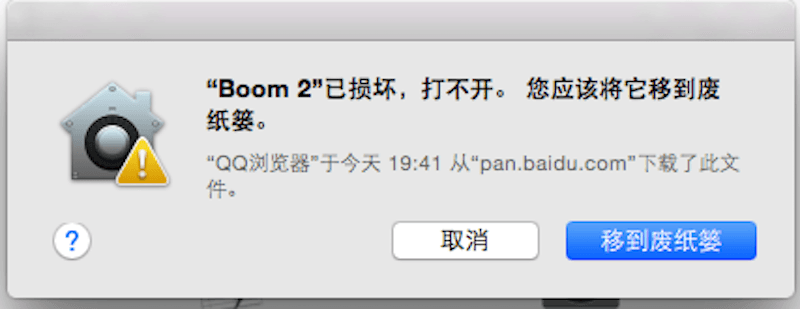
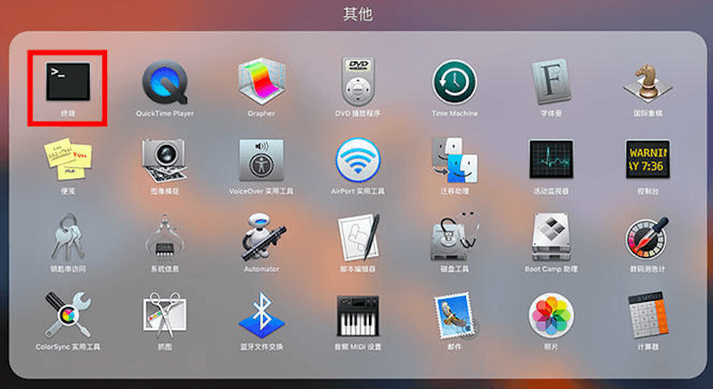
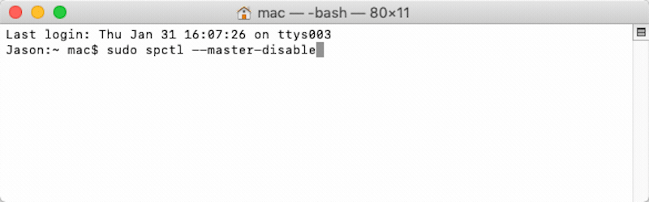
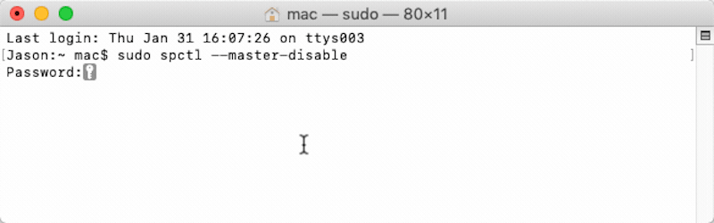
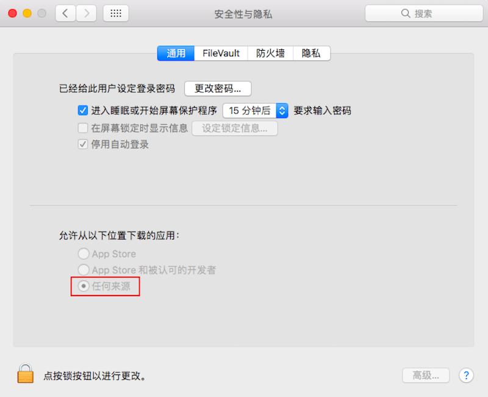

# Mac安装软件时提示已损坏的解决方法

安装时总是提示“已损坏，移至废纸篓”这类信息，根本无法打开。如下图：

其实，这是新系统（macOS Sierra 10.12.X）惹的祸。新系统加强了安全机制，默认不允许用户自行下载安装应用程序，只能从Mac App Store里安装应用。

#### 解决方法

**步骤一**：打开终端（按F4启动Launchpad，终端默认在“其他”中）

**步骤二**：输入代码：sudo spctl --master-disable（**master前面为两个短横线，看下面的截图**）

**步骤三**：按回车输入自己电脑密码，再次回车（密码不会显示出来，放心输就好）

不显示密码，输完按回车

**步骤四**：打开系统偏好设置 » 安全性与隐私，若显示*任何来源*，大功告成；若没有此选项，一定是你前面的步骤不对

回到桌面双击安装文件，发现都可以打开啦，尽情享受Mac带给你的乐趣吧！

