# MacApps

**QQ交流群:`285746487`**

**Mac安装软件时提示已损坏的解决方法**:[点我直达](Help.md)

提供的所有信息资源均为网上收集整理而来，仅供学习和研究使用。
注：
> - 本项目会在可预知的未来内不断更新
> - 破解软件不建议升级，以防出现破解失效

---
快速查找需要的app： 
> 注：可通过command+f(Mac)或Ctrl+f(Windows)来快速查找需要的app是否包含。

---

## CleanMyMac X `4.4.6`
[**下载地址**](https://dev.tencent.com/u/ChenJie1219/p/MacApps/git/raw/master/APP/CleanMyMac%20X.zip)

CleanMyMac X 是Mac os系统上一款先进的、集所有功能于一身的实用系统清理工具，它能帮助保持您的Mac保持清洁。只需两个简单的点击，就可以删除无用的文件，以节省您宝贵的磁盘空间。CleanMyMac可以流畅地与系统性能相结合，清洁不需要的语言、记录更新、清洁缓存、快速安全擦除、应用卸载和清空回收站等重要功能。CleanMyMac可以为您节省硬盘空间，提高电脑的速度。CleanMyMac X一定会使您的Mac更加出色。

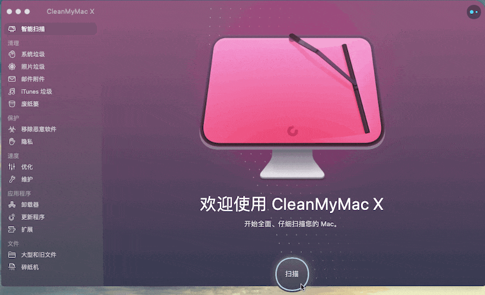

## Charles `4.2.8`
[**下载地址**](https://dev.tencent.com/u/ChenJie1219/p/MacApps/git/raw/master/APP/Charles.zip)

Charles 是一款Mac上的HTTP代理服务器、HTTP监视器、反向代理服务器，可以让开发者监视查看所有连接互联网的HTTP通信，包括请求，响应和HTTP头信息等等，俗称“抓包”工具，对于Web开发人员来说是一款很有价值的辅助工具！

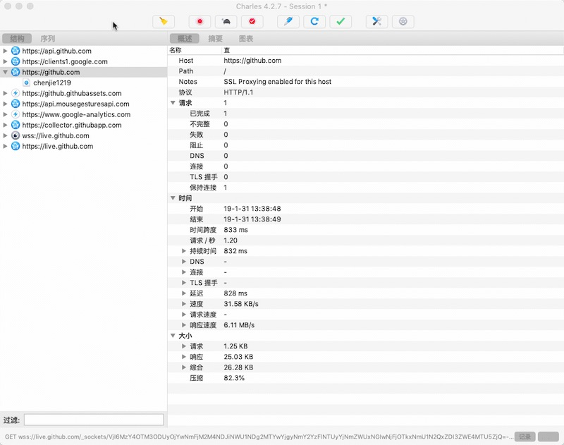

## Hopper Disassembler
[**下载地址**](https://dev.tencent.com/u/ChenJie1219/p/MacApps/git/raw/master/APP/Hopper%20Disassembler%20v4.dmg)

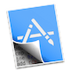
Hopper Disassembler 是一款Mac上强大的二进制反编译工具，可让您对应用程序进行反汇编，反编译和调试。

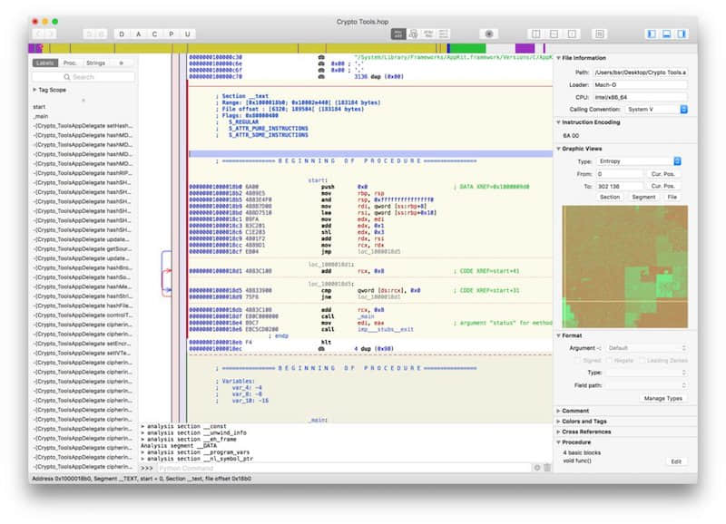

## Reveal `21`
[**下载地址**](https://dev.tencent.com/u/ChenJie1219/p/MacApps/git/raw/master/APP/Reveal.dmg)

Reveal 是Mac os平台上的一款开发者调试IOS应用的Mac开发软件，它能够在运行时调试和修改iOS应用程序。Reveal能连接到应用程序，并允许开发者编辑各种用户界面参数，这反过来会立即反应在程序的UI上。

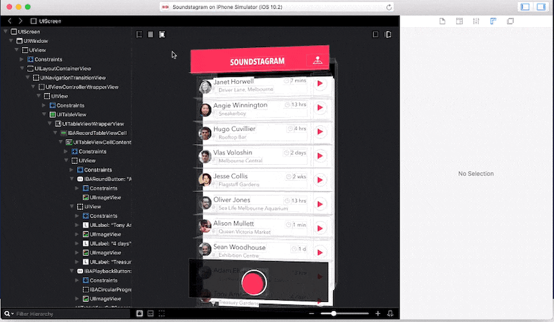

## MWeb `3.2.3`
[**下载地址**](https://dev.tencent.com/u/ChenJie1219/p/MacApps/git/raw/master/APP/MWeb.zip)

MWeb 是一款Mac上专业的Markdown写作、记笔记、静态博客生成软件，是一站式的 Markdown 编辑和静态网站生成解决方案，支持大量 Markdown 扩展语法。

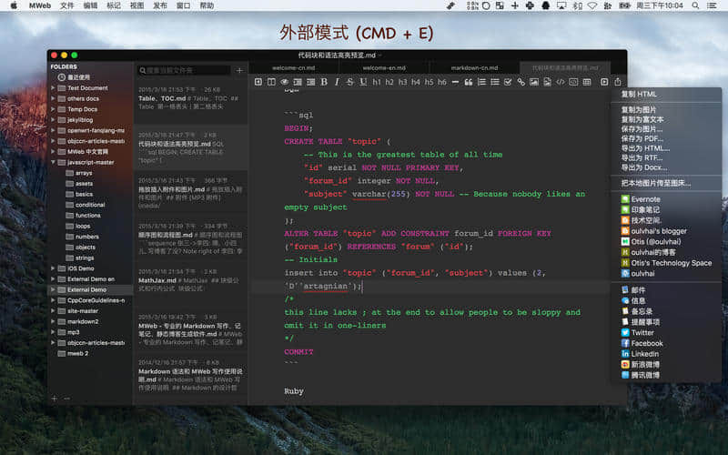

## Beyond Compare `4.2.10`
[**下载地址**](https://dev.tencent.com/u/ChenJie1219/p/MacApps/git/raw/master/APP/Beyond%20Compare.zip)

Beyond Compare这是一款号称码农神器的软件，Beyond Compare能够在Mac OS系统上非常专业的对比两个文件或者两个文件夹的不同之处，并把每一个不同之处以不同的颜色加以区分，你可以很清楚很明显的了解到两个相似文件的不同支持，便于开发者们和设计人员工作之用。

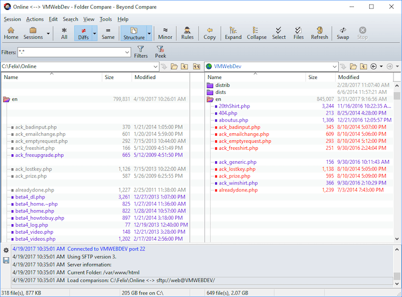

## IconFly `3.9.1`
[**下载地址**](https://dev.tencent.com/u/ChenJie1219/p/MacApps/git/raw/master/APP/IconFly.zip)

IconFly 是一个令人难以置信的节省时间，让您可以轻松地在多种格式为你的Mac，iPhone，iPad和Apple关注应用程序创建的图标。此外，IconFly允许您为Android应用程序以及Web剪辑图标和图标创建图标。IconFly得到了积极支持并不断更新。
支持图标创建的图像格式：PNG，JPEG，TIFF，GIF，ICNS，PSD，EPS，AI，PDF。

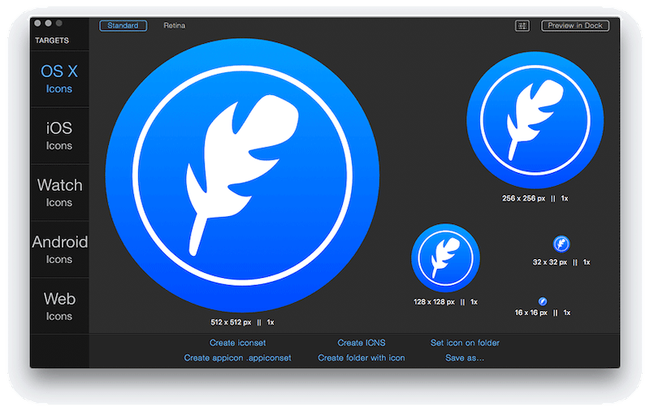

## FlawlessApp `0.9.9`
[**下载地址**](https://dev.tencent.com/u/ChenJie1219/p/MacApps/git/raw/master/APP/FlawlessApp.zip)

FlawlessApp 是一款专为UI设计师及开发者打造的一款UI原型矫正工具。可以让你的iOS应用看起来与预期设计完全一样。通过实时比较所有内置于iOS模拟器的预期和实施设计。我们为那些痴迷于移动应用程序质量的人们打造了无瑕疵。

**选择设计文件**

只需从界面中选择一个设计，或将&拖放文件拖到菜单栏中的无瑕应用程序图标Live Home 3D上。您可以选择一种或多种不同格式的设计：草图，jpeg，png，tiff或gif。

**选择比较模式**

选择设计文件后，它将出现在iOS模拟器上。您可以使用叠加或拆分比较模式来查看预期设计和CADintosh X实现之间的任何视觉差异。Flawless App支持纵向和横向屏幕的比较，因此您可以逐像素地检查每个设计的质量。

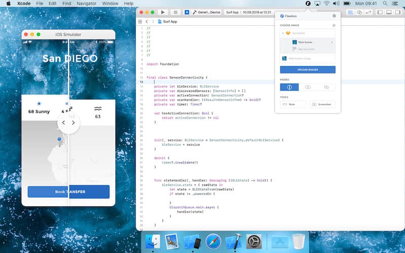

## Archiver `3.0.7`
[**下载地址**](https://dev.tencent.com/u/ChenJie1219/p/MacApps/git/raw/master/APP/Archiver.zip)

Archiver 是一款Mac上优秀的压缩解压缩工具，具有压缩包加密、分卷压缩、压缩包内图片和音乐优化、压缩包内容预览等功能，支持拖拽压缩/解压缩，尤其是能够自动优化压缩图片和音乐类型的文件，软件的界面UI也非常的漂亮，支持所有常见的压缩格式，甚至支持Linux RPM、DMG、PAX等格式!

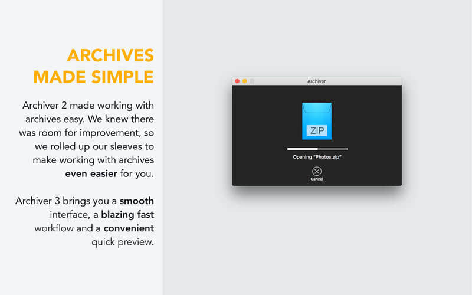

## Navicat Premium 中文版 `12.1.23`
[**下载地址**](https://dev.tencent.com/u/ChenJie1219/p/MacApps/git/raw/master/APP/Navicat%20Premium.zip)

Navicat Premium 是最优秀的数据库图形化管理客户端，支持MySQL、SQL Server、SQLite、Oracle 和 PostgreSQL 等数据库，支持数据库建模，正向和反向工程，数据同步等功能，而Premium版本是包含了Navicat所有功能的最强大版本，是首选的数据库客户端工具！

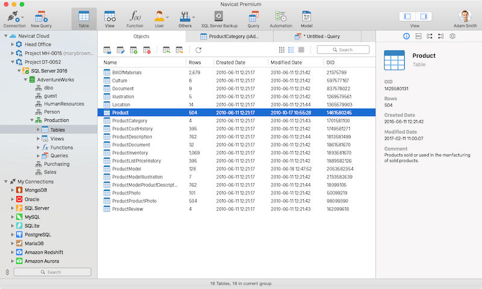

## Downie `3.8.2`
[**下载地址**](https://dev.tencent.com/u/ChenJie1219/p/MacApps/git/raw/master/APP/Downie%203.zip)

Downie 是一款Mac上的非常好用的在线视频下载工具，支持包括Youtube、优酷等国内外750多个在线视频网站的视频下载，支持中文界面，支持下载暂停恢复等新功能，软件简单易用，只需要拖拽或输入视频网址就可以自动下载。

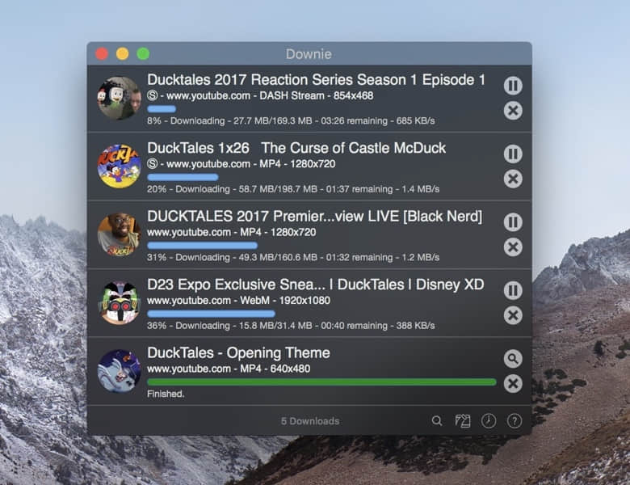

## Creo `2.1.1`
[**下载地址**](https://dev.tencent.com/u/ChenJie1219/p/MacApps/git/raw/master/APP/Creo.zip)

Creo for Mac开发工具，移动应用，集成了支持设计的用户界面和编写权力效用。旨在移动应用程序的开发工具的代码将设计和编码相关的任务置于同一屋檐下。该实用程序使您可以创建和自定义应用程序的布局，同时还提供对基于对象的编程的支持。

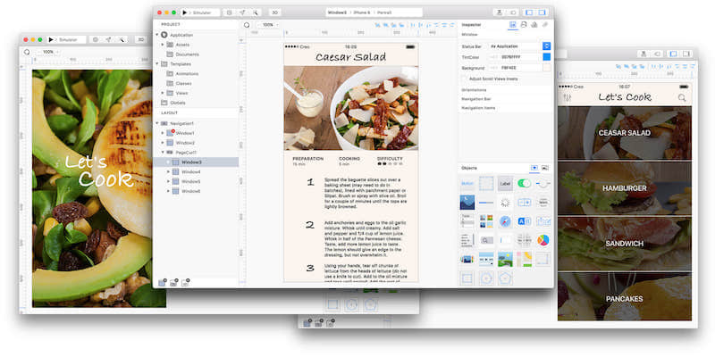

## Transmit `5.5.2`
[**下载地址**](https://dev.tencent.com/u/ChenJie1219/p/MacApps/git/raw/master/APP/Transmit.zip)

Transmit 是一款 Mac 上的 FTP 客户端，无论在界面还是用户体验上做的都很好，支持连接历史记录、喜爱列表、双栏浏览、连接为本地磁盘等，除了FTP协议外，还支持SFTP、亚马逊的S3、WebDAV等协议，连接和文件传输速度都很快，非常不错, Mac 上首选的 FTP 客户端！

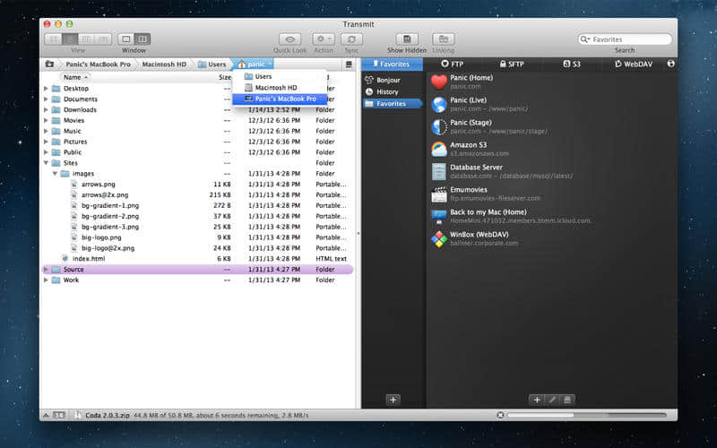

## Dash `4.6.5`
[**下载地址**](https://dev.tencent.com/u/ChenJie1219/p/MacApps/git/raw/master/APP/Dash.zip)

Dash 是使用与Mac OS平台的软件编程文档管理工具，可以浏览API文档，以及管理代码片段工具。Dash自带了丰富的API文档，涉及各种主流的编程语言和框架。 Dash内置了丰富的API文档，让我们集中管理API文档，包括下载、搜索、查阅并支持集成到XCode、Alfred等软件中，非常的强大！

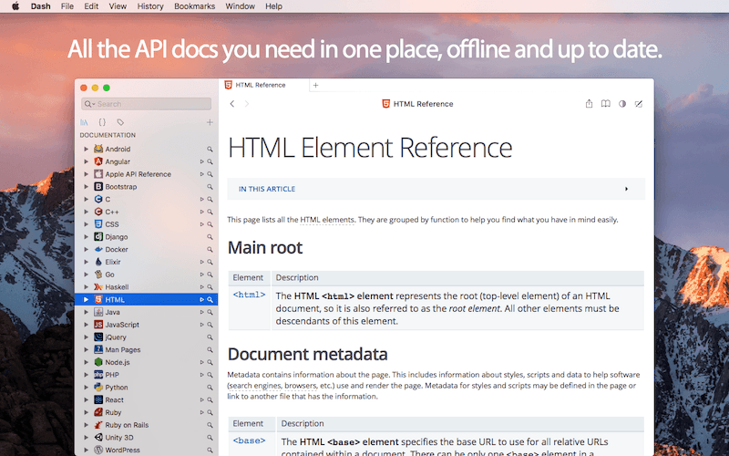

## MacBooster `7.2.5`
[**下载地址**](https://dev.tencent.com/u/ChenJie1219/p/MacApps/git/raw/master/APP/MacBooster.zip)

MacBooster 是一款Mac上优秀的系统安全扫描和垃圾清理工具，MacBooster 除了具有类似 CleanMyMac 的垃圾清理和软件卸载功能外，还支持系统安全扫描、内存清理、重复文件查找等功能，其一键扫描功能也很实用！

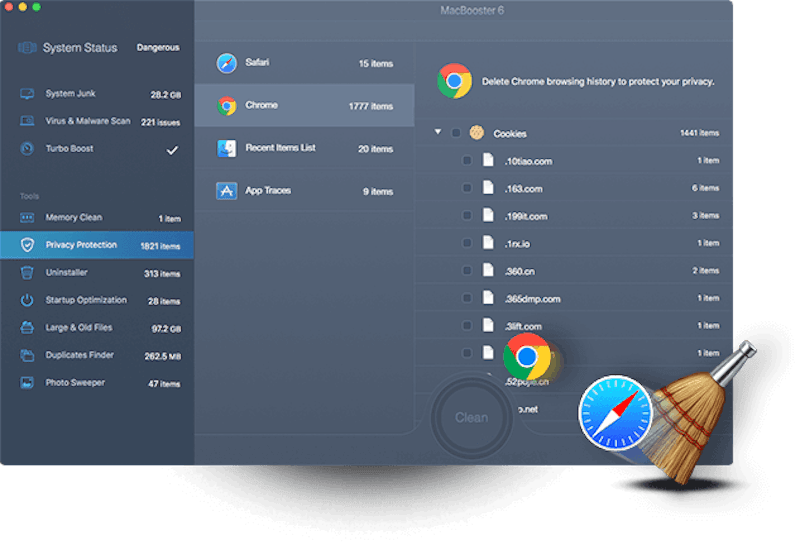

## iMazing `2.9.14`
[**下载地址**](https://dev.tencent.com/u/ChenJie1219/p/MacApps/git/raw/master/APP/iMazing.zip)

iMazing 是一款Mac上优秀的 iOS 设备管理工具，功能与 iTools Pro 一样，可以让我们方便管理iOS设备的短信、联系人、照片、视频、音乐等等，方便在Mac和iOS设备间导入导出文件，支持最新的 iPhone  和 iOS  系统，界面也很漂亮！

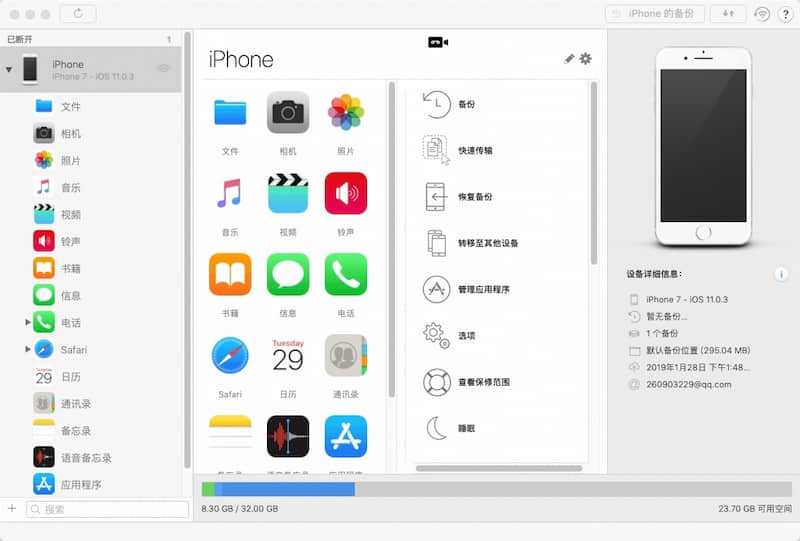

## MarginNote `3.3.6007`
[**下载地址**](https://dev.tencent.com/u/ChenJie1219/p/MacApps/git/raw/master/APP/MarginNote.zip)

MarginNote 是一款Mac上功能强大的阅读和学习工具软件，它将PDF/EPUB阅读器和多种学习工具集成起来，使得学习者可以在学习时从不同的维度将知识进行重组，连接，从而达到记住，领会的效果，很不错的一款阅读学习工具！

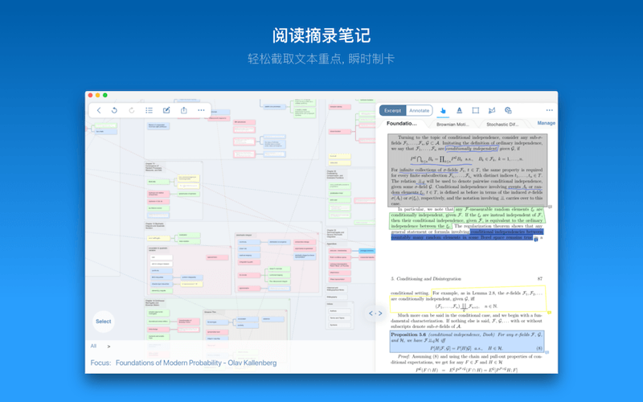

## Icons8 `5.6.7`
[**下载地址**](https://dev.tencent.com/u/ChenJie1219/p/MacApps/git/raw/master/APP/Icons8.zip)

Icons for mac是一款运行在macOS平台上的图标素材软件。这款软件中有70000+个图标供您搜索。可以帮助用户轻松找到需要查找的图标，使用非常方便。

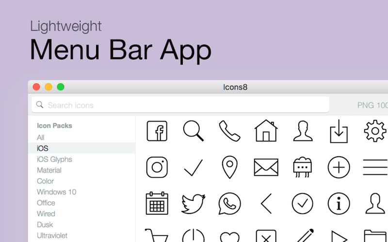

## Alfred `4.0.4`
[**下载地址**](https://dev.tencent.com/u/ChenJie1219/p/MacApps/git/raw/master/APP/Alfred%204.zip)

Alfred 是Mac上最好用的快速启动工具，修复了大量问题，Alfred能够让我们使用键盘去完成应用的搜索和启动、信息的本地和Web搜索、查询字典、剪切板查看、系统控制等等功能，简单易用，能够大大提高使用Mac的效率，此外，Alfred还具有大量扩展插件可以安装，Powerpack增强包提供了很多优秀的功能，绝对是高效率使用Mac的必备工具。

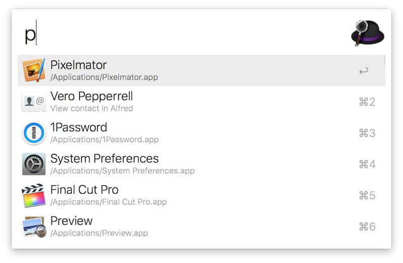

## Sketch `57.1`
[**下载地址**](https://dev.tencent.com/u/ChenJie1219/p/MacApps/git/raw/master/APP/Sketch.zip)

Sketch 是一款Mac上小巧但功能强大的矢量绘图软件，最新版本，增加了大量新的功能，尤其是Sketch Mirror，相比其他的矢量绘图软件，比如AI，Sketch的优点在于使用简单，学习曲线低，让我们能够用Sketch快速的绘制图形，可以说是轻量级的 AI，Sketch 提供了基本的形状，支持自动切图，PDF、EPS、SVG等格式文件的导入和导出，并且增加了移动设计模板，非常适合进行网站设计。

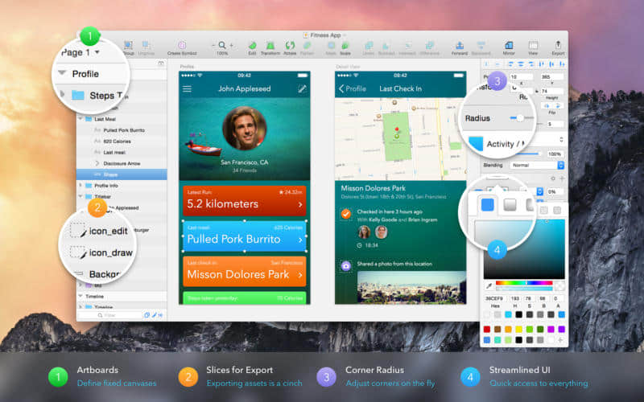

## Pixelmator Pro `1.3.2`
[**下载地址**](https://dev.tencent.com/u/ChenJie1219/p/MacApps/git/raw/master/APP/Pixelmator%20Pro.zip)

Pixelmator Pro 是知名的绘图软件Pixelmator的专业高级版本，专为Mac开发和优化，包含了全新的工作流以及更直观简单的编辑软件。它还采用了单窗口界面以及基于机器学习的智能图像编辑功能。它可以与 macOS High Sierra 完美集成，可以自动完成水平检测，智能快速选择以及更好的修复工具等优点，很强大!

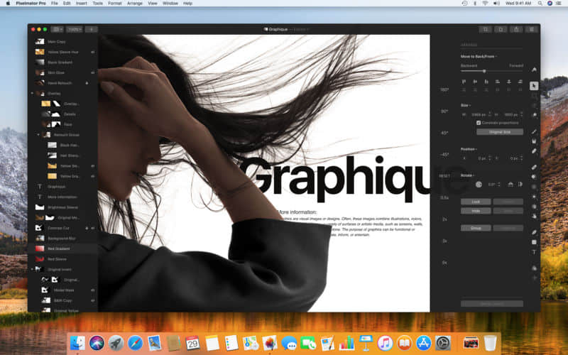

## 1Password `7.3`
[**下载地址**](https://dev.tencent.com/u/ChenJie1219/p/MacApps/git/raw/master/APP/1Password.zip)

1Password 是Mac上最优秀的密码管理工具，其最优秀之处是强大的浏览器插件和跨平台同步功能，1Password 在安全和方便间做了最好的平衡，能够自动生成复杂的密码并记忆，通过一个主密码管理你的所有密码，支持Safari、Firefox、Chorme、Opera等浏览器，自动登陆网站，并且除了Mac平台，还支持iOS平台，之间可通过iCloud同步，支持中文！

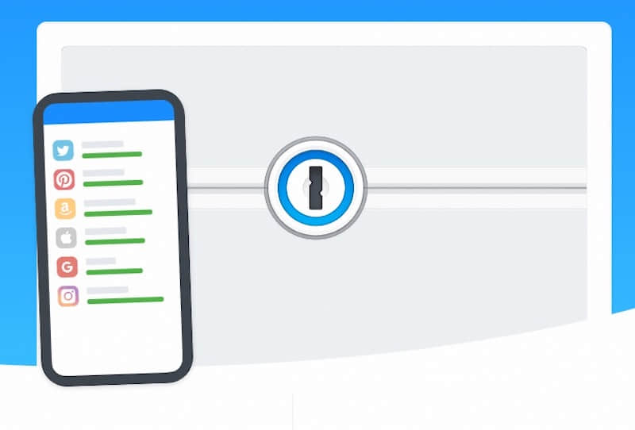

## Sublime Text `3208`
[**下载地址**](https://dev.tencent.com/u/ChenJie1219/p/MacApps/git/raw/master/APP/Sublime%20Text.zip)

Sublime Text 是Mac os平台上的一款非常不错的代码编辑器,同时 Sublime Text 也是跨平台的，界面和功能感觉和 TextMate 比较相似。此外他的窗口分组、项目管理、扩展工具、代码折叠方面都非常不错,还直接支持 vim 模式。

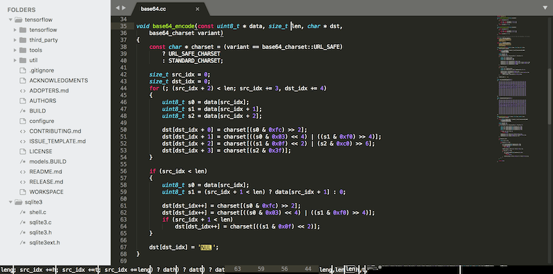

## iRingg `1.0.40`
[**下载地址**](https://dev.tencent.com/u/ChenJie1219/p/MacApps/git/raw/master/APP/iRingg.zip)

iRingg 可以让你从任何你能在互联网上找到的任何东西中制造个性化的铃声。可以轻松地从iTunes库里的歌曲中删除音频片段，或者在SoundCloud或YouTube上立即找到它们。添加声音效果(称为SndMoji™️)或记录自己的声音和使用过滤器来创建非常个人的铃声。将新创建的铃声直接推送到iPhone(有线或无线连接)，它将出现在默认的铃声部分。

## ePublr `1.2.2`
[**下载地址**](https://dev.tencent.com/u/ChenJie1219/p/MacApps/git/raw/master/APP/ePublr.zip)

ePublr 是一款将文档转换为epub文件格式的工具。它不仅以不同的格式创建图书的副本，还会优化版面，文字和图像。所有转换后的书籍都可以通过iBooks轻松打开以便同步和阅读。ePublr 包含具有7种配色方案的epub阅读器。

## Boom 3D `1.3.1`
[**下载地址**](https://dev.tencent.com/u/ChenJie1219/p/MacApps/git/raw/master/APP/Boom%203D.zip)

Boom 3D 是Boom系列全新的版本，相比于以前的Boom版本，新版本主要立足于3D音效增强，当你觉得你的Mac播放音乐或视频声音太小时，可以使用Boom这款软件提高音量，支持iTunes和QuickTime等播放器，还支持改善语音聊天的音效，非常强大！

## Sip `1.1.5`
[**下载地址**](https://dev.tencent.com/u/ChenJie1219/p/MacApps/git/raw/master/APP/Sip.zip)

Sip 是一款设计师和前端应该会需要的屏幕取色软件，你只需要鼠标点一下即可取得屏幕当前位置的颜色值，并将数据自动存到剪切板，方便随时粘贴出来。支持 CSS、UIColor 等多种格式。

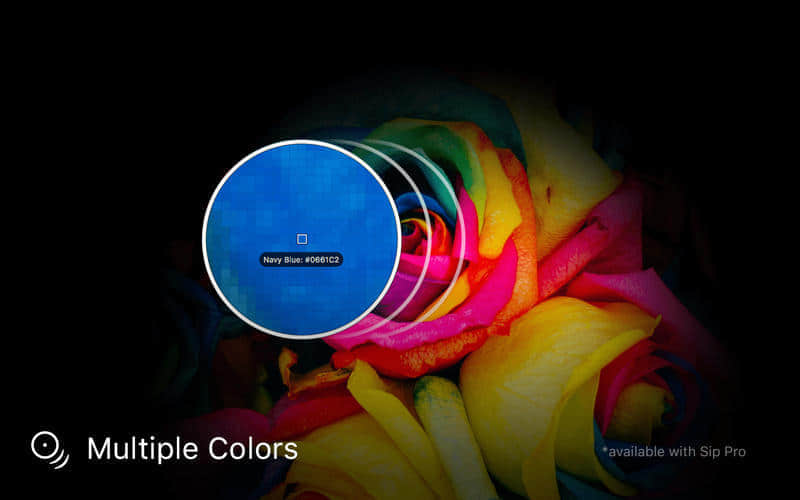

## Trim Enabler `4.2`
[**下载地址**](https://dev.tencent.com/u/ChenJie1219/p/MacApps/git/raw/master/APP/Trim%20Enabler.zip)

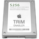
Trim Enabler Pro是一款Mac上实用的固态硬盘维护和检测工具, 如果你安装的是第三方的SSD，比如自己换了个固态硬盘，那么就一定要使用这款软件来开启固态硬盘的TRIM功能，以提高SSD的使用寿命，当然，Appple自带的SSD默认是开启Trim的，但Trim Enabler除了提供开启TRIM功能外，还具有硬盘SMART检测、温度监控、提高数据写入速度、Benchmark基带测试、硬盘各种状态的检测等等功能，非常的强大！

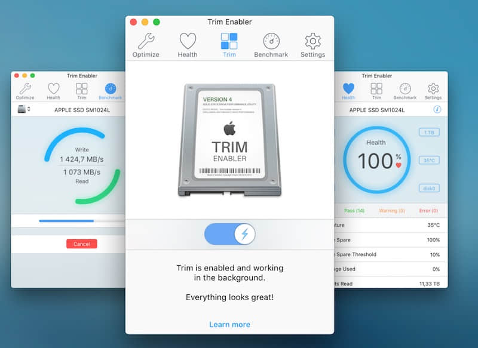

## CrossOver `18.5`
[**下载地址**](https://dev.tencent.com/u/ChenJie1219/p/MacApps/git/raw/master/APP/CrossOver.zip)

CrossOver 是一款可以让我们直接在Mac上安装和运行Windows软件和游戏的工具，CrossOver已经支持一万多款软件，包括大部分主流软件，如Microsoft Office、AutoCAD、Windows Media Player 9、Adobe Photoshop、Dreamweaver、Internet Explorer等知名软件。

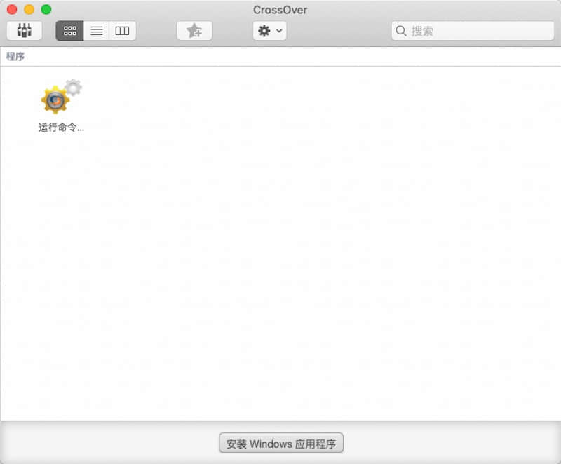

## VMware Fusion `11.1.0`
[**下载地址**](https://dev.tencent.com/u/ChenJie1219/p/MacApps/git/raw/master/APP/VMware%20Fusion.zip)

VMware Fusion Pro 将 Mac® 上的虚拟化提升到更高的级别，它拥有强大的功能特性，专业技术人员无需重新启动即可在 Mac 上运行 Windows® 应用。利用针对类似 Windows 10 这样的最新现代操作系统的额外支持，高级用户、开发人员、QA 和 IT 管理员每天都依赖 Fusion Pro 实现高性能、高可用性和领先的功能特性，从而支持在 Mac 上运行 Windows 和 Linux。

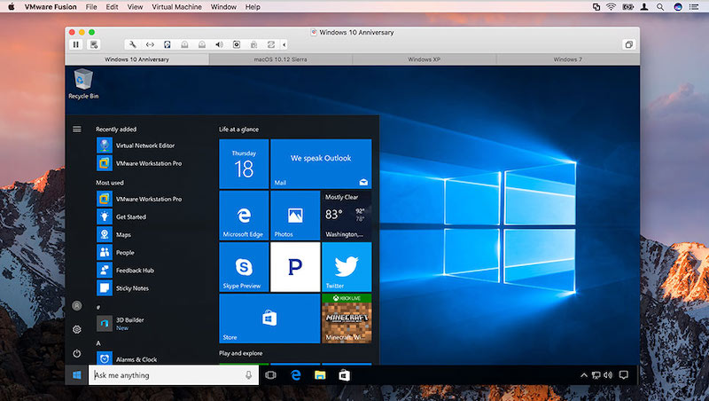

## Parallels Desktop `14.1.3`
[**下载地址**](https://dev.tencent.com/u/ChenJie1219/p/MacApps/git/raw/master/APP/Parallels%20Desktop.zip)

Parallels Desktop for Mac 是功能最强大灵活度最高的虚拟化方案，无需重启即可在同一台电脑上随时访问Windows和Mac两个系统上的众多应用程序。从仅限于PC的游戏到生产力软件，Parallels Desktop都能帮您实现便捷使用。

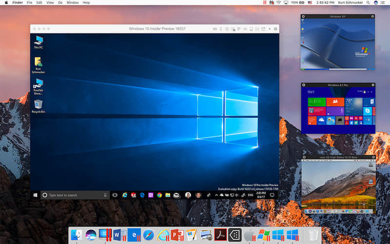

## Adobe Zii Patcher `4.4.2`
[**下载地址**](https://dev.tencent.com/u/ChenJie1219/p/MacApps/git/raw/master/APP/Adobe%20Zii%20Patcher.zip)

目前支持以下Adobe CC 2019 Mac 授权激活

Adobe Acrobat DC

Adobe After Effects CC 2019

Adobe Animate CC 2019

Adobe Audition CC 2019

Adobe Bridge CC 2019

Adobe Character Animator CC 2019

Adobe Dreamweaver CC 2019

Adobe Illustrator CC 2019

Adobe InCopy CC 2019

Adobe InDesign CC 2019

Adobe Lightroom CC

Adobe Lightroom Classic CC

Adobe Media Encoder CC 2019

Adobe Photoshop CC 2019

Adobe Prelude CC 2019

Adobe Premiere Pro CC 2019

Adobe XD CC

Adobe Premiere Rush

其余的等待TNT团队更新

**使用说明**

安装软件（断网安装不用登陆）并退出，打开破解补丁 Adobe Zii，单击“PATCH OR DRAG”,然后会提示权限不够，此时点击“OK”，输入系统密码即可破解成功，提示登录可不予理会，可完美破解使用。
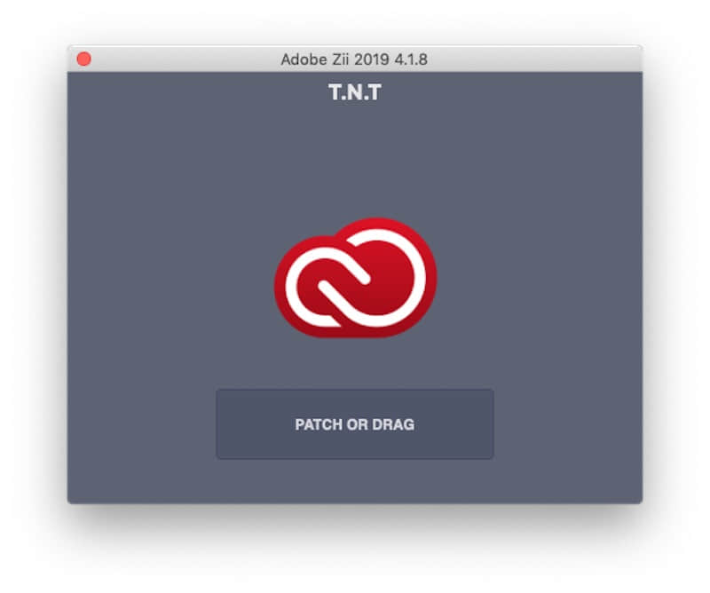
##  Microsoft_Office_2019_VL_Serializer
[**下载地址**](https://dev.tencent.com/u/ChenJie1219/p/MacApps/git/raw/master/APP/Microsoft_Office_2019_VL_Serializer.zip)

支持 Microsoft Office 2019 授权激活

**使用说明**

下载并安装 Microsoft Office 2019 for Mac 安装包，然后安装 Microsoft_Office_2019_VL_Serializer.pkg
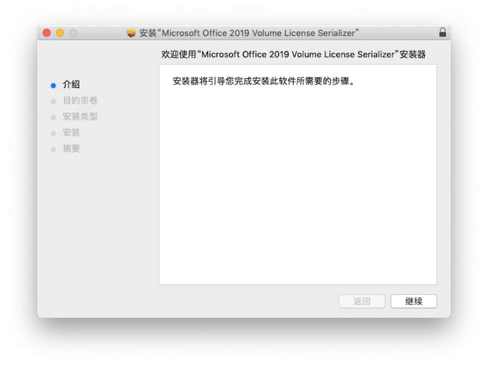
##  Paragon NTFS `15.5.53`
[**下载地址**](https://dev.tencent.com/u/ChenJie1219/p/MacApps/git/raw/master/APP/Paragon%20NTFS.zip)

Paragon NTFS 可以说是 Mac 上最知名的一款 NTFS 分区驱动了，能够让我们读写 NTFS 分区，因为在Mac OS X 系统上，默认对NTFS分区只能读而不能写，但我们的移动硬盘或U盘很多都是用NTFS进行的分区，所以当你发现在Mac上无法往移动硬盘或U盘中写入数据时，大部分原因是你没有按照NTFS分区驱动，安装此软件即可。
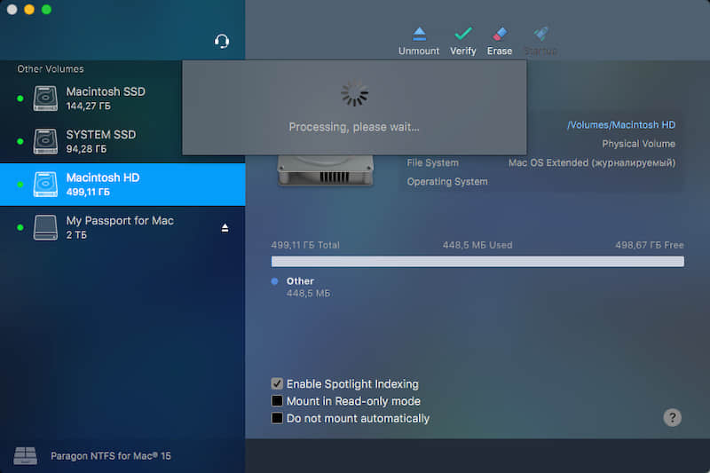
##  Path Finder `8.6`
[**下载地址**](https://dev.tencent.com/u/ChenJie1219/p/MacApps/git/raw/master/APP/Path%20Finder.zip)

Path Finder 是一个文件浏览器，结合熟悉的搜索界面与强大的实用程序和创新的功能。Path Finder  是一款功能强劲并足以取代Finder的超赞软件，它完全能够媲美Finder，并且屡受好评。
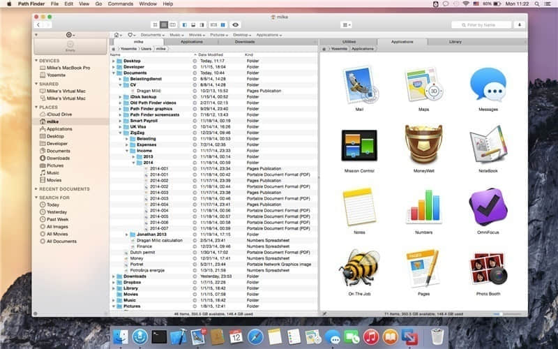
##  DMG Canvas `2.4.4`
[**下载地址**](https://dev.tencent.com/u/ChenJie1219/p/MacApps/git/raw/master/APP/DMG%20Canvas.zip)

DMG Canvas是一款Mac上快速生成DMG镜像的工具，能够自定义镜像的背景、名称、窗口大小和出现位置等等，非常的好用！
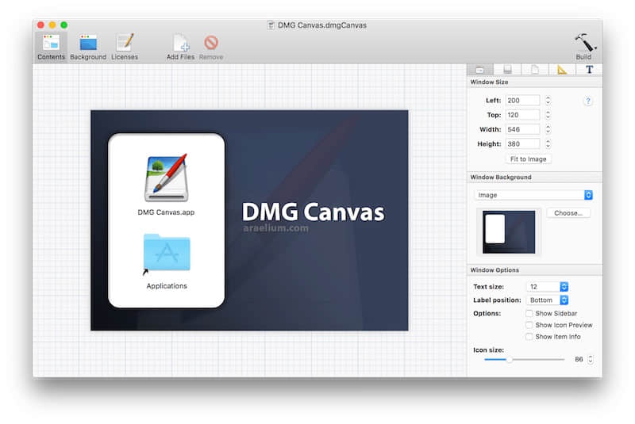
##  Polarr Photo Editor Pro `5.5.7`
[**下载地址**](https://dev.tencent.com/u/ChenJie1219/p/MacApps/git/raw/master/APP/Polarr%20Photo%20Editor%20Pro.zip)

泼辣修图是一款Mac上给广大摄影玩家和发烧友设计的高级且易用的修图软件，增加了Photos.app 拓展插件等功能，软件小巧但功能强大，12组高质量的滤镜组合针对迅速修片！

##  Keka `1.1.17`
[**下载地址**](https://dev.tencent.com/u/ChenJie1219/p/MacApps/git/raw/master/APP/Keka.zip)

Keka 是比较常用的压缩软件，体积小，简单易用，速度较快。
支持压缩：7z、Zip、Tar、Gzip、Bzip2。
支持解压：RAR、7z、Lzma、Zip、Tar、Gzip、Bzip2、ISO、EXE、CAB、PAX、ACE(PPC)。
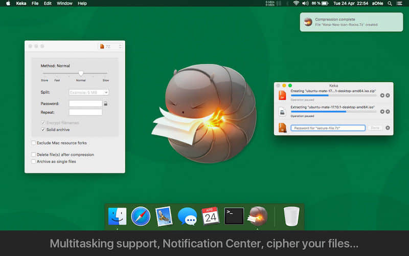
##  PDF Expert `2.4.24`
[**下载地址**](https://dev.tencent.com/u/ChenJie1219/p/MacApps/git/raw/master/APP/PDF%20Expert.zip)

PDF Expert 是备受称赞的PDF阅读工具，界面简洁、PDF打开和浏览速度都很不错，要比自带的预览好用多了.

##  AdGuard `2.1.2`
[**下载地址**](https://dev.tencent.com/u/ChenJie1219/p/MacApps/git/raw/master/APP/AdGuard.zip)

Adguard 是一款功能强大的广告和弹出窗口拦截工具。它适用于所有安装的浏览器，如Firefox、Opera等，有效去除烦人的广告，减少了页面加载时间，并节省您的流量。而且，Adguard还能有效过滤包括反钓鱼和反恶意。
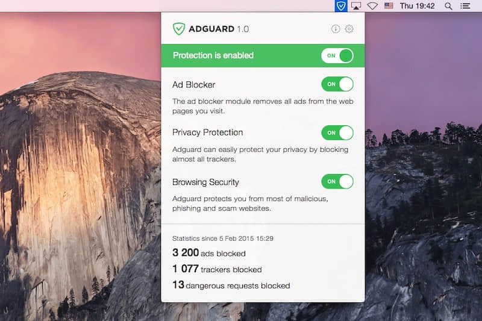
##  Enolsoft PDF Converter with OCR `6.3.0`
[**下载地址**](https://dev.tencent.com/u/ChenJie1219/p/MacApps/git/raw/master/APP/Enolsoft%20PDF%20Converter%20with%20OCR.zip)

PDF Converter with OCR for Mac是一款具有OCR(光学字符识别技术)的PDF转换器，pdf converter with ocr mac版可以准确识别PDF中的文本，图像和表格，能够将PDF转换为完全15种文档格式，功能非常强大。
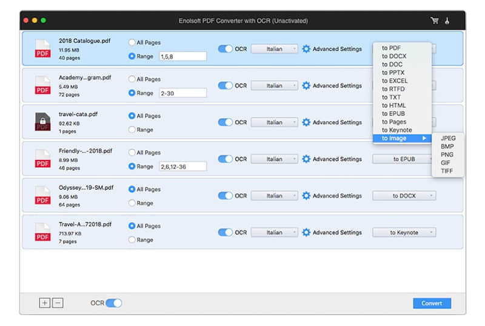
##  Wondershare Recoverit `8.0.1.6`
[**下载地址**](https://dev.tencent.com/u/ChenJie1219/p/MacApps/git/raw/master/APP/Recoverit.zip)

Wondershare Recoverit 是一个非常可靠的数据恢复工具，它可以从任何存储介质中恢复数据。无论你的数据从哪里丢失，它就能从哪里帮您找回来，包括删除的文件，回收站，格式化磁盘，分区丢失，外部设备，病毒攻击数据等等。
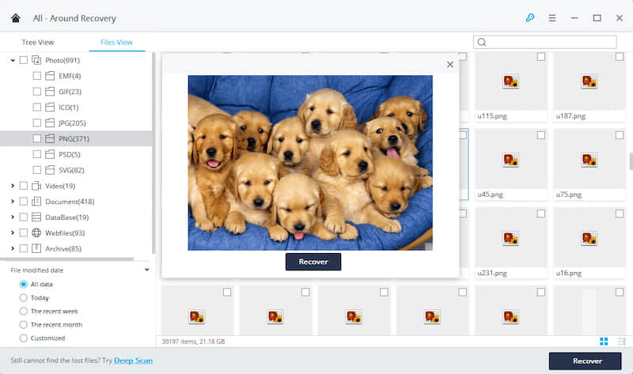
##  Axure RP `9.0.0.3650`
[**下载地址**](https://dev.tencent.com/u/ChenJie1219/p/MacApps/git/raw/master/APP/Axure%20RP%209.zip)

Axure RP是最知名和最强大的专业的快速原型设计工具，让负责定义需求和规格、设计功能和界面的专家能够快速创建应用软件或Web网站的线框图、流程图、原型和规格说明文档。
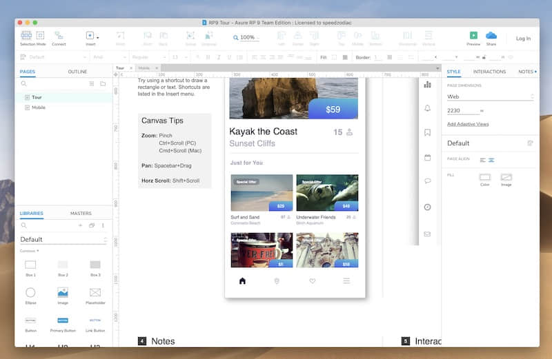
##  Fantastical 2 `2.5.10`
[**下载地址**](https://dev.tencent.com/u/ChenJie1219/p/MacApps/git/raw/master/APP/Fantastical%202.zip)

Fantastical 2是iOS & Mac 平台最知名的日历应用，增加很多新的功能，带来了诸多卓越的日历体验。Fantastical 2 采用了全新的设计风格，和 Yosemite 系统十分贴合，增加了大量新的功能，如Handoff协作、黑白颜色、完全时区、本地语言等等！
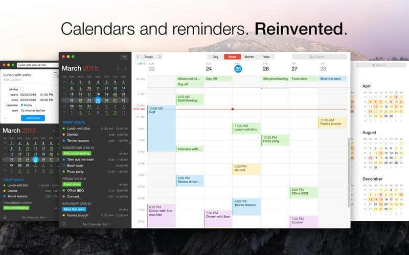
##  iText `1.3.0`
[**下载地址**](https://dev.tencent.com/u/ChenJie1219/p/MacApps/git/raw/master/APP/iText.zip)

iText是一款从图片中识别文字的OCR（光学字符识别）工具。通过截图、拖拽图片，即可以从扫描版的PDF等任意图片中识字，并且可以很好的解决摘抄和批注需求。使用腾讯、Google双引擎，识别效果惊人地准确。
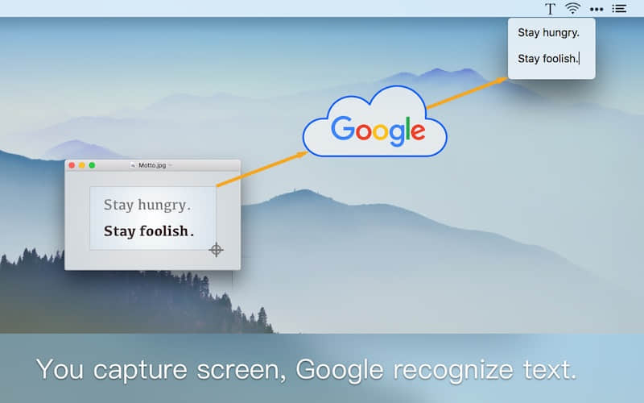
##  uBar `4.1.4`
[**下载地址**](https://dev.tencent.com/u/ChenJie1219/p/MacApps/git/raw/master/APP/uBar.zip)

uBar 是一款让你的 Mac 拥有类似 Windows 的任务栏的工具，如果你不想要 Dock 栏，还是喜欢 Windows 上的任务栏，那么这款软件就可以帮助你实现这个需求，当然，Dock和任务栏也可以一起使用
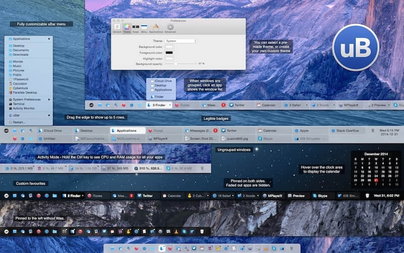
##  PDF Squeezer `3.10.4`
[**下载地址**](https://dev.tencent.com/u/ChenJie1219/p/MacApps/git/raw/master/APP/PDF%20Squeezer.zip)

PDF Squeezer是一款Mac上压缩PDF文件大小的工具，仅需要简单的拖拽，就可以快速的压缩PDF文件的体积，针对图片生成的PDF文件可以很好的压缩大小，支持批量处理和自定义压缩配置。
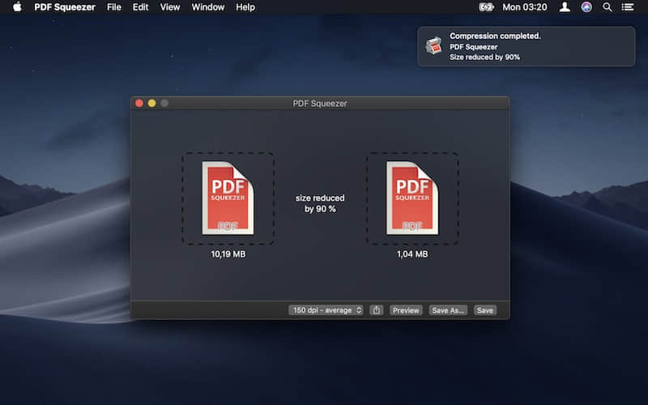
##  Goldie App `1.3.1`
[**下载地址**](https://dev.tencent.com/u/ChenJie1219/p/MacApps/git/raw/master/APP/Goldie%20App.zip)

Goldie App 是mac上一款非常强大的黄金比例设计工具，Goldie App体积小巧，可以驻留在系统的菜单栏之上，随时提供给用户调用。而且拥有独特的计算功能，可以帮助你在任何需要的时候获得精确的黄金比例。还有先进的设置和美丽的黑暗模式可以选择，非常好用！
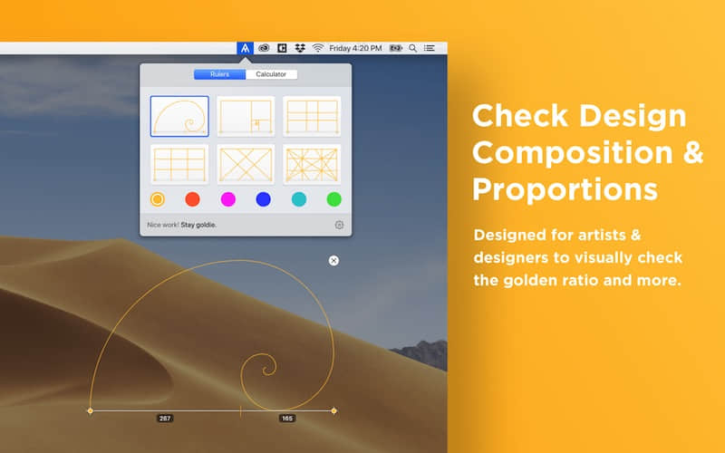
##  Enolsoft PDF Password Remover `3.0.1`
[**下载地址**](https://dev.tencent.com/u/ChenJie1219/p/MacApps/git/raw/master/APP/Enolsoft%20PDF%20Password%20Remover.zip)

解锁PDF，解锁内容，删除Mac上的PDF密码，以便轻松打开，编辑和打印PDF。
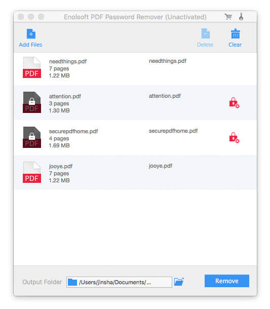
##  XMind ZEN `9.2.1`
[**下载地址**](https://dev.tencent.com/u/ChenJie1219/p/MacApps/git/raw/master/APP/XMind%20ZEN.zip)

XMind ZEN 是一款全新的思维导图软件，也是Xmind新出的产品。Xmind ZEN采用全新的内核，拥有经典Xmind操作体验，完美坐到一种全新却不失经典的体验，界面简洁，上手容易操作简单。
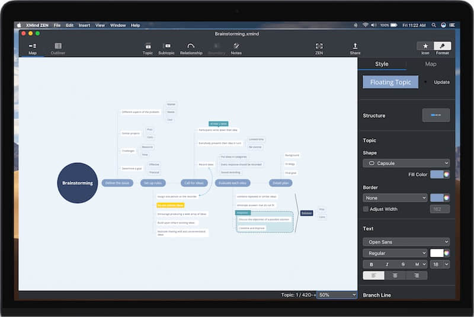
